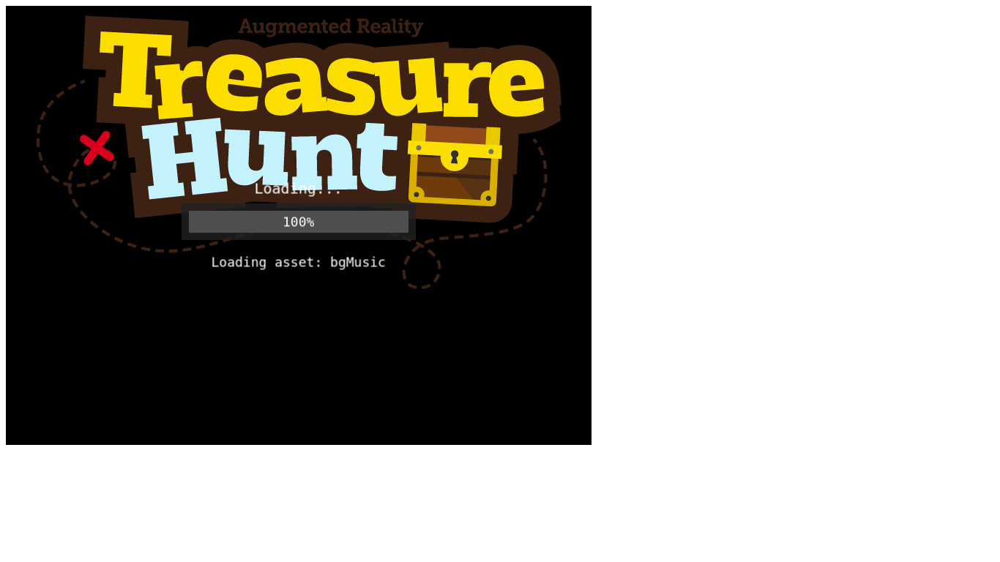
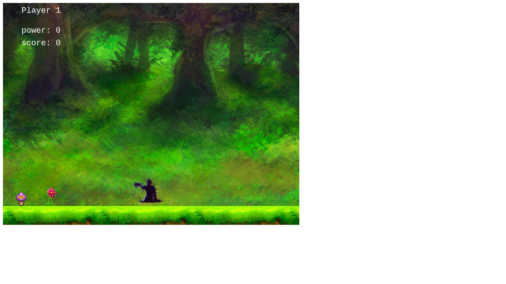
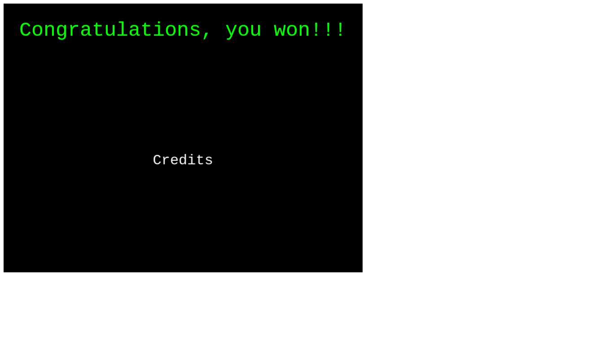
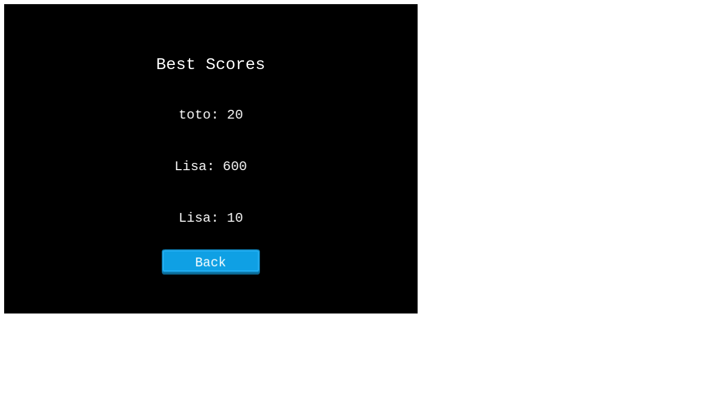

# JavaScript Capstone Project - Platform Game

<h1 align="center">
  Treasure Hunt
</h1> 

> Final project in the Microverse JavaScript Curriculum

Implementation of a Jump-Based Endless Runner Game built with the [Phaser 3](https://phaser.io/phaser3) framework


## About The Project

The main objective of this project was to build a platform game.


Live version of the project: [Live version]()

Project Link: [Javascript-Capstone](https://github.com/patriciachrysy/javascript-capstone)

## The game

- A simple game in 2D
- the main character must fovercome allthe dangers and obstacles to get the treasure box
- he has 0 power in the begining but he can pick up magic flower to get them and he can throw fire on the badies
- he must either avoid badies or throw fire at them to make them disapear
- he dies if he colides with badies
- he has to collect magic flowers to recharge his powers
- The game ends when he finally collects the treasure box.

### How to play

- When the game starts, choose some options and then click on the menu button
- Afterward, click on the play button and written your name in the box
- Use key left and right to move the player horizontally, up to jump, and space to throw fire on badies

#### Get a local copy

*npm required* - [get npm](https://www.npmjs.com/get-npm)

### Installation

You can always use the [live version]() to play right away or install it locally using these steps:

**Clone the repository by running this command in your terminal**
```
git clone https://github.com/patriciachrysy/javascript-capstone.git
```

**Navigate into the newly created folder**
```
cd javascript-capstone
```

#### Get the dependencies needed for the game

`$ npm install`

#### Start the server and the fun
`$ npm run start`

**Visit this link to see the game in your browser** 
```
http://localhost:8000/
```

**Run Jest tests**
```
npm run test
```


### Design

All of the sprites, backgrounds, buttons and the background music can be found on [OpenGameArt](https://opengameart.org/)

**Landing Scene**



**Game Scene**



**Credits Scene**



**Leaderboard Scene**




## Technologies used

- JavaScript
- HTML/CSS
- [Phaser 3](https://phaser.io/phaser3)
- Babel
- Webpack
- ESlint
- Jest
- Netlify 
- [Leaderboard API](https://www.notion.so/microverse/Leaderboard-API-service-24c0c3c116974ac49488d4eb0267ade3) for tracking scores

## Contact 


👤 **Manezeu Patricia Chrystelle**

- Github: [@githubhandle](https://github.com/patriciachrysy)
- Twitter: [@twitterhandle](https://twitter.com/ManezeuP)
- Linkedin: [linkedin](https://www.linkedin.com/in/manezeu-patricia-chrystelle-095072118/)

## Contributing

Contributions, issues and feature requests are welcome!

Feel free to check the [issues page](https://github.com/patriciachrysy/javascript-capstone/issues).

## Show your support

Give a ⭐️ if you like this project!

## Acknowledgments

- Microverse
- Phaser 3
- OpenGameArt 
- [https://www.emanueleferonato.com/](https://www.emanueleferonato.com/)
- Webpack
- npm
